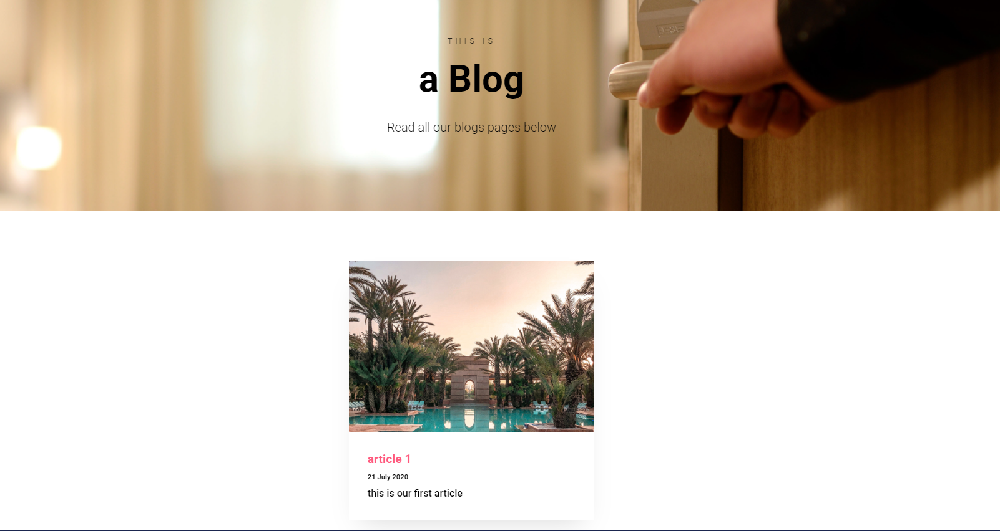
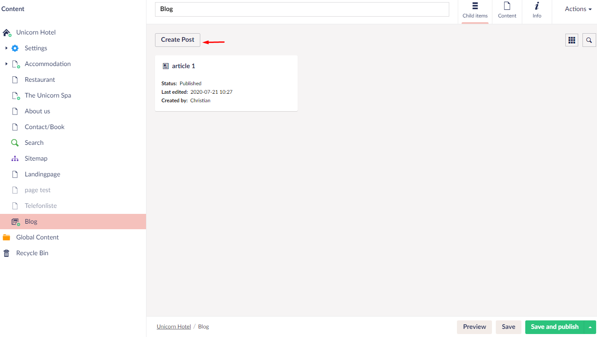

---
versionFrom: 8.0.0
---

# The Blog
In this guide you will learn, to set up a blog with a feed that contains the blog posts. 

When you are done with this guide you will have a blog that looks something like this:

## How to set up the blog

We will start by making the blog page, which will contain the posts we will create in the feed.

1. First, we will navigate to the content tree on the left
2. In the content tree hover over Unicorn Hotel and click ... button
3. After clicking the ... button select feed from the menu that shows up
4. Name this what you would like it to be called in this case we will name it Blog(if there's already a blog page you might have to delete that first)
5. After naming the blog page, go to widgets and select the hero widget
6. Set up the hero widget as you would like it and hit ***save*** or ***save and publish***
7. After doing this the Blog page itself is done

## How to set up the feed

In this part, we will set up the feed for our blog, so that we will have some posts on our blog page.

1. Click the ... button next to the Blog node in the tree
2. Select Post
3. Give the post a name
4. Fill out the content section with what you want the blog post to be about
5. Head to the Meta section
6. In the date section select the publishing date for the post
7. The image here is a thumbnail for the post
8. Finalize by writing a short description of the post and hit ***save** or ***save and publish***

## How to add more blog posts to the feed

A blog usually consists of multiple posts, so this is how you add more blog posts after you have created the first blog post.

1. Click the blog node
2. Now you should see a window showing the first post you made
3. From here click ***Create Post***
4. From there it is the same approach as explained above

:::note
What if you want to edit the blog page itself? well, you can do this by clicking the blog page and navigating to the top right corner and clicking the ***Content*** button, and to switch back to the post overview Click ***Child items***
:::
